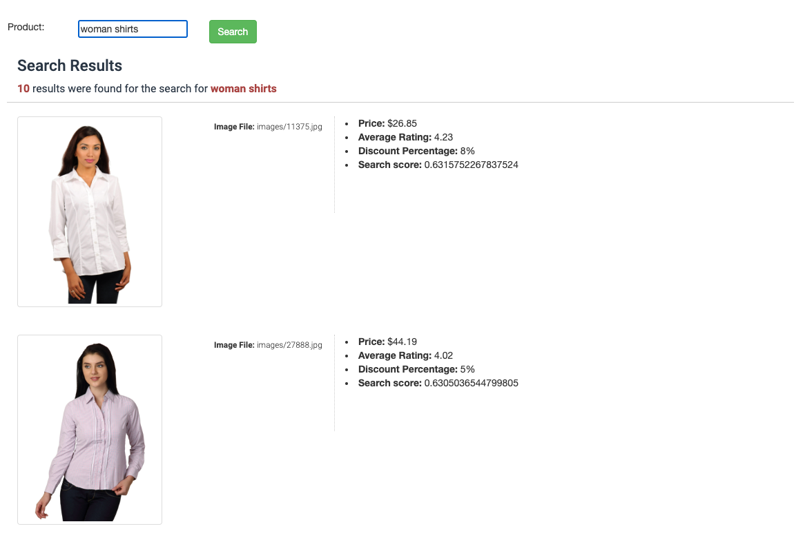
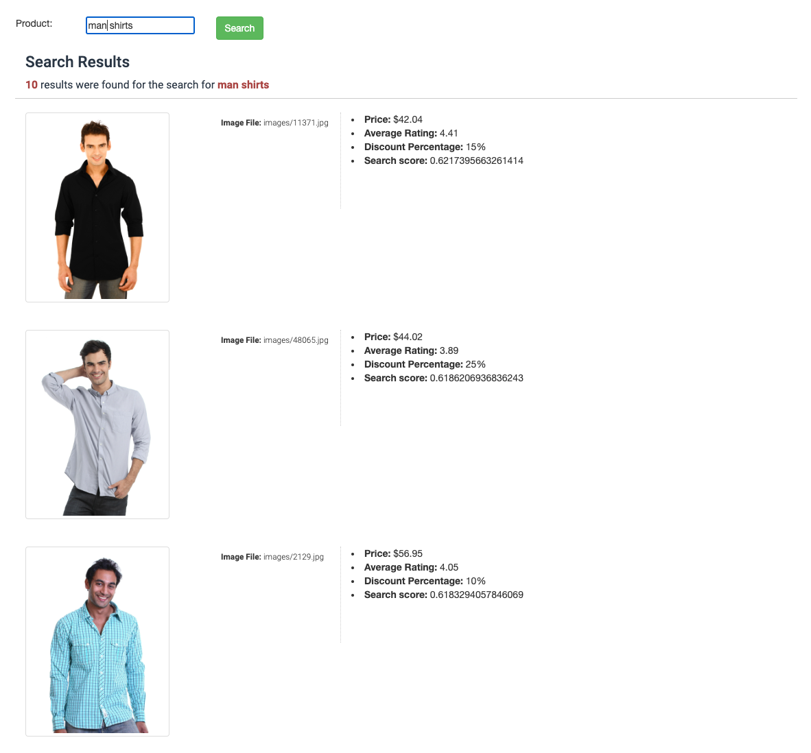

# MongoDB Atlas Vector Search (Images) on Fashion Products

# Atlas Vector Search on Fashion Products

How can a search be conducted for the visual attributes of products that were not included in the product's metadata?
To clarify further, imagine having millions of fashion products without any information about their color or category. You have the following basic data model:

```json
{
    "imageFile": "images/7475.jpg",
    "price": 15.66,
    "discountPercentage": 7,
    "avgRating" : 3.47
}
```

Furthermore, our users wish to perform a search such as **"green shirts"** and our objective is to retrieve the products where the corresponding image (e.g., images/7475.jpg) portrays a **green shirt**. This can be easily achieved using Vector Search.

Consider this search query: On the right side, you'll find a sample entry from a database that lacks metadata like the product's "color" or "category." Nevertheless, our search appears to be successful as it matches the visual attributes of the product.


In simpler terms, the application transforms the given texts into vectors, which are then sent to MongoDB Atlas. Using Atlas Search, the system compares these vectors with those in the collection and identifies the most similar vectors to the given one.

Another example:


# Prerequisites

- Download the image dataset from the Kaggle.
  - First, download the product data set from Kaggle (25GB), [here ](https://www.kaggle.com/datasets/paramaggarwal/fashion-product-images-dataset)https://www.kaggle.com/datasets/paramaggarwal/fashion-product-images-small
  - If you don't want to wait 25GB of data to be downloaded, you can download the lower size product dataset (600MB) [here](https://www.kaggle.com/datasets/paramaggarwal/fashion-product-images-small), that have lower resolution images.

    - After you've downloaded the compressed file, extract it somewhere.
    - After the compressed file extracted, move the following `images` folder (only this folder) into this repository's `encoder/` folder.
    - 
    - So this repository folders structure should look like this:
    - 
- MongoDB Atlas Cluster with the M10 tier in your preferred region
- Execution was successful with the following dependencies
  - Check the steps in the section [link][# Steps to Install and Test]
  - Python 3.9.2 along with pip
    - Following libraries will be required
      - Flask==2.1.0
      - Pillow==9.3.0
      - pymongo==4.1.1
      - sentence_transformers==2.2.2
    - `requirements.txt` includes all the dependencies and if you want to install dependencies in one shot:
      ```bash
      pip install -r requirements.txt
      ```

# Steps to Install and Test

## Configure database connection

Please make the necessary changes to the `config/config_database.py` file by updating the database connection string, as well as the details of the database and collection.

## Create the Search Index

Please create the search index on the collection specified in the configuration file, and make sure to name the index as `default `. Use the following JSON for the index creation:

```json
{
  "mappings": {
    "fields": {
      "imageVector": [
        {
          "dimensions": 768,
          "similarity": "cosine",
          "type": "knnVector"
        }
      ],
      "price": {
        "type": "number"
      },
      "averageRating": {
         "type": "number"
      },
      "discountPercentage": {
        "type": "number"
      }
    }
  }
}
```

## Run Image Encoding and Store the Vector in the database

Thousands of images have already been downloaded (Kaggle dataset) and we will run encoding on the application side and store the vectors of these images inside the database.

Switch to `encoder/` folder and make sure the `images/` folder includes the image files.
And run the `encoder_and_loader.py`

```bash
$ python encoder_and_loader.py
```

It will download the pre-trained model first and then will create worker threads (It will run on 8 threads by default, you can configure this in the python file), and these threads will go through all the files under the `images/` folder and load the vectors inside the MongoDB collection.


The process may require a considerable amount of time, which is dependent on the hardware resources available on the machine. If the machine has 8 cores, it might take several hours (3-4) to complete. The application itself is the limiting factor as it generates the embeddings for the images. Increasing the cluster size will not expedite this operation. This operation is not resumable, in other words, if somehow this loader crashes, it will start from scratch (by deleting data in the target collection).

Once the process is finished, you can verify the collection using the instructions provided below.


## Run the Web Application to Search for Products

Switch to `webapp/` folder and run `flask_server.py`.

```bash
$ python flask_server.py
```

This web application has 2 pages:

For a simple product search, open a browser and navigate to `http://localhost:5010/`.
For advanced search (multiple conditions), navigate to `http://localhost:5010/advanced`.

And give it a try!
------------------


## Some Screenshots here:






