# MongoDB Atlas Vector Search (Images) on Fashion Products

# Atlas Vector Search on Fashion Products

How to make a search on the visual characteristic of the products that were not part of the metadata of the product? 
Let me be more clear, you have millions of fashion products and you don't have color/category information of the product and you have the following simple data model:

```json
{
    "imageFile": "images/7475.jpg",
    "price": 15.66,
    "discountPercentage": 7,
    "avgRating" : 3.47
}
```

And, our end users would like to make a search like "green shirts" and we want to return the products that the image (e.g. images/7475.jpg) represents a green shirt. 
It's very simple with Vector Search as shown in the below:

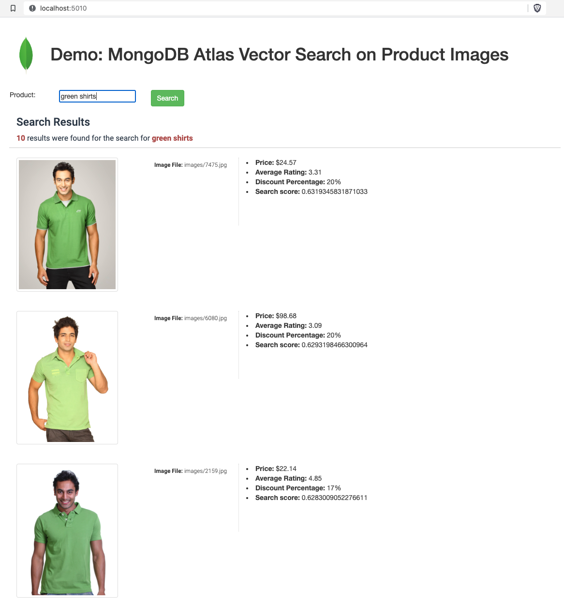
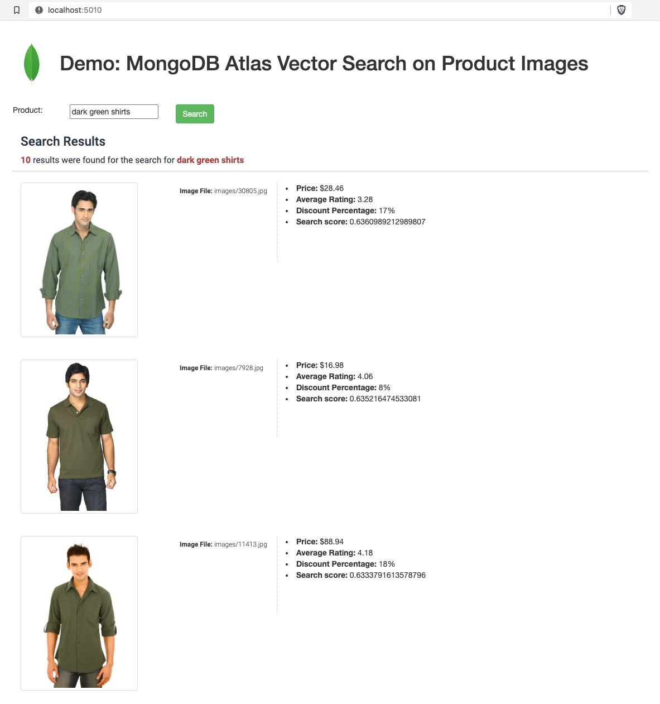

# Prerequisites

- Download the image dataset from the Kaggle. 
    - First, download the low-resolution images to test everything correct (280MB): https://www.kaggle.com/datasets/paramaggarwal/fashion-product-images-small
        - After you've downloaded the compressed file, extract it somewhere. 
        - After the compressed file extracted, move the following `images` folder, into the `encoder/` folder of this repository. 
        - 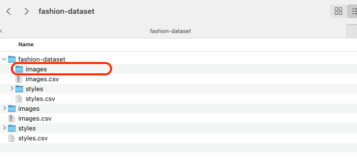
        - So the repository folders structure should look like this:
        - 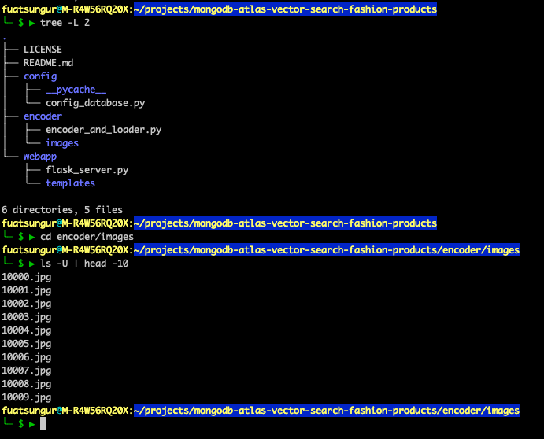
    - After you verify that everything works properly then you can download higher resolution images (25GB): https://www.kaggle.com/datasets/paramaggarwal/fashion-product-images-dataset 
- MongoDB Atlas Cluster with the M10 tier in your preferred region
- Execution was successful with the following dependencies
  - Check the steps in the section [link][# Steps to Install and Test]
  - Python 3.9.2 along with pip
    - Following libraries will be required
      - Flask==2.1.0
      - Pillow==9.3.0
      - pymongo==4.1.1
      - sentence_transformers==2.2.2
    - `requirements.txt` includes all the dependencies and if you want to install dependencies in one shot:
      ```bash
      pip install -r requirements.txt
      ```


# Steps to Install and Test

## Configure database connection 

Modify the `config/config_database.py` file accordingly with the database connection string, database and collection information. 

## Create the Search Index

Create the following search index on the collection that you configured in the config file:

```json
{
  "mappings": {
    "fields": {
      "imageVector": [
        {
          "dimensions": 768,
          "similarity": "cosine",
          "type": "knnVector"
        }
      ],
      "price": {
        "type": "number"
      },
      "averageRating": {
         "type": "number"
      },
      "discountPercentage": {
        "type": "number"
      }
    }
  }
}
```

## Run Image Encoding and Store the Vector in the database

Thousands of images have already been downloaded and we will run encoding on the application side and store the vector inside the database. 

Switch to `encoder/` folder and make sure the `images/` folder includes the image files.
And run the `encoder_and_loader.py` 

```bash
$ python encoder_and_loader.py
```

It will download the pre-trained model first and then will create worker threads and these threads will go through all the files under the `images/` folder and load the vectors inside the MongoDB collection.

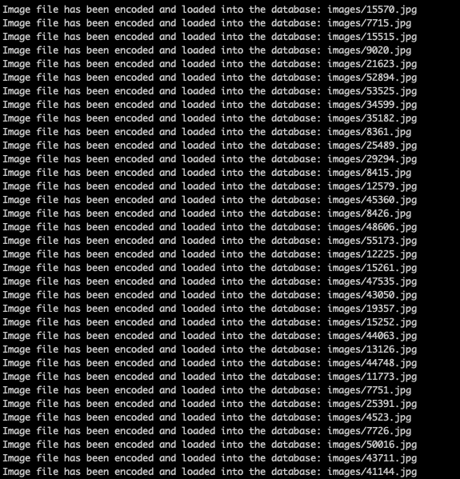

It will take some time (depending on the hardware resources on the machine where you run it. With 8 cores it might take a few hours). 
After it's completed, then verify the collection as shown in the below:

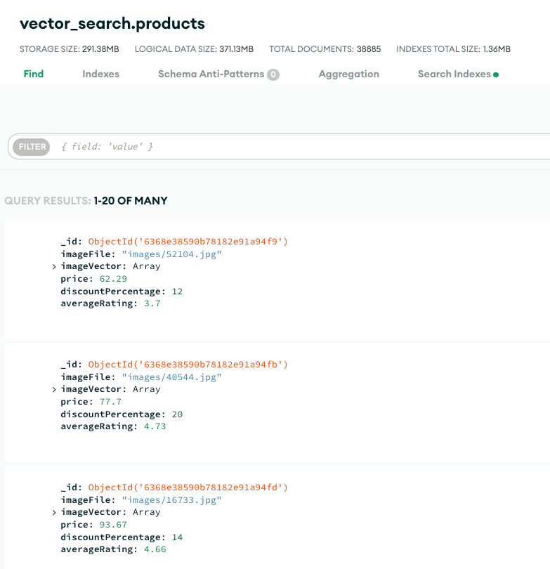

## Run the Web Application to Search for Products

Switch to `webapp/` folder and run `flask_server.py`.

```bash
$ python flask_server.py
```

This web application has 2 pages:

For a simple product search, open a browser and navigate to `http://localhost:5010/`.
For advanced search (multiple conditions), navigate to `http://localhost:5010/advanced`.

And give it a try! 
---

---
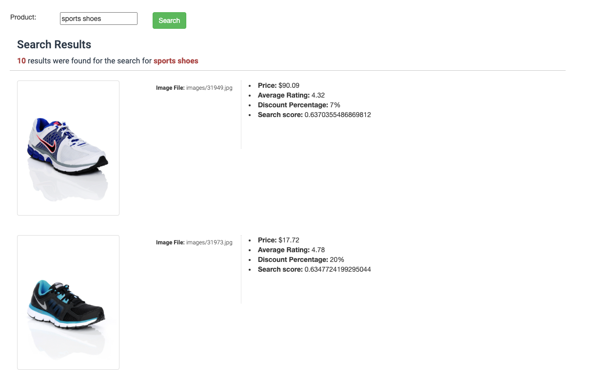
---
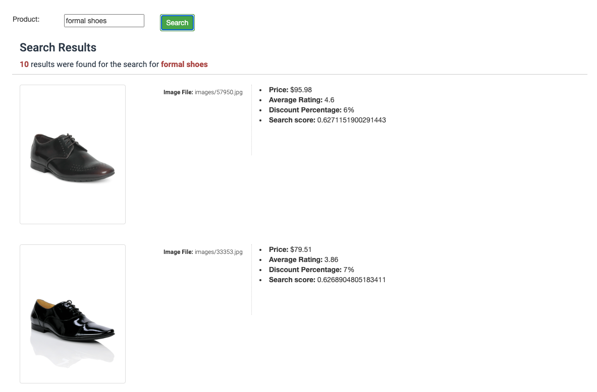
---

---
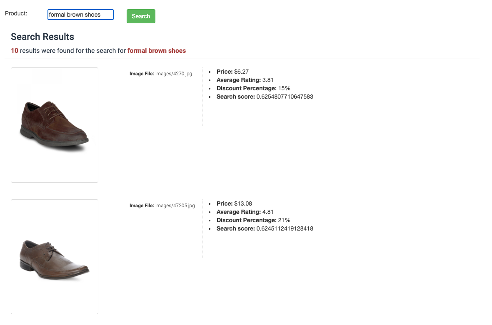
---

---
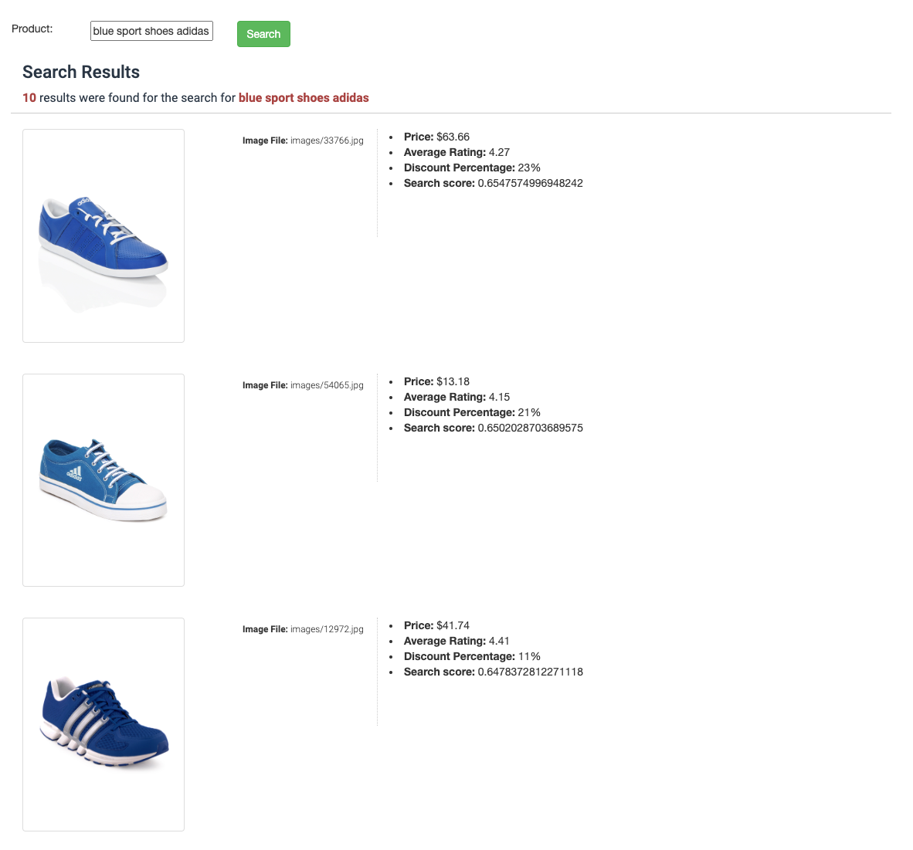
---
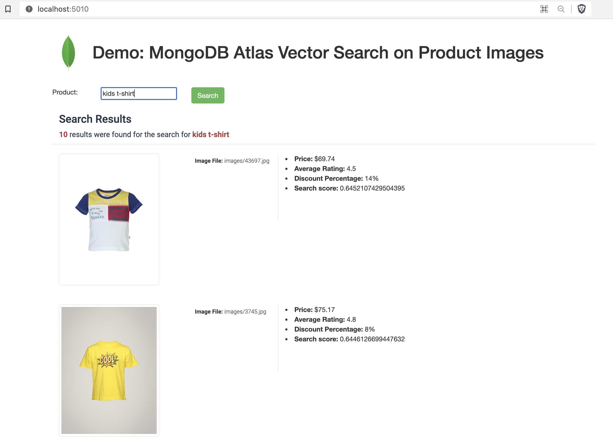
---
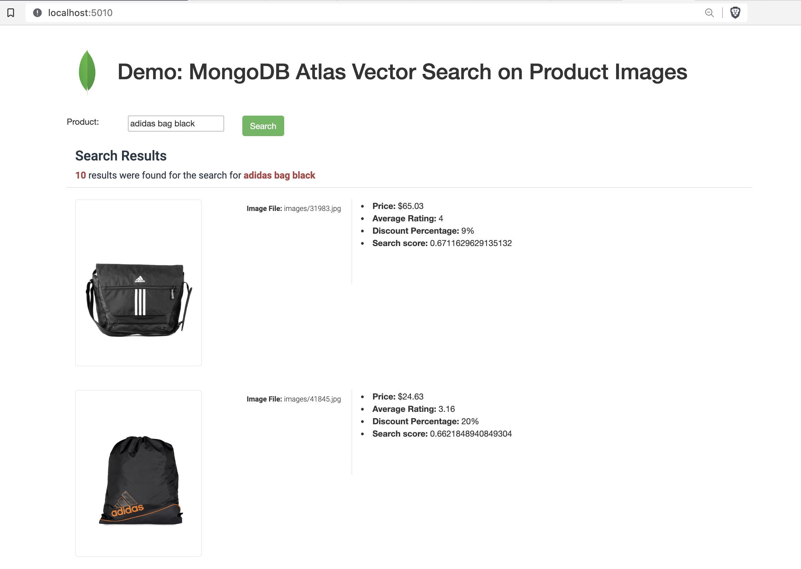
---
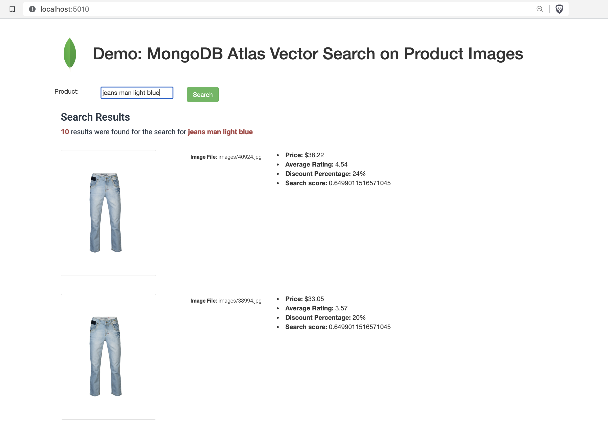
---
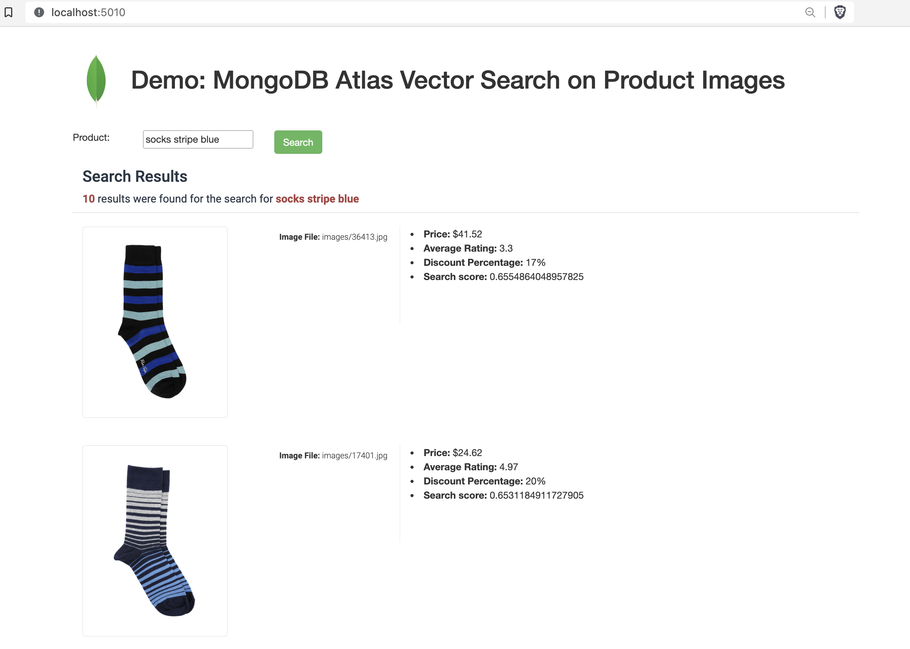


