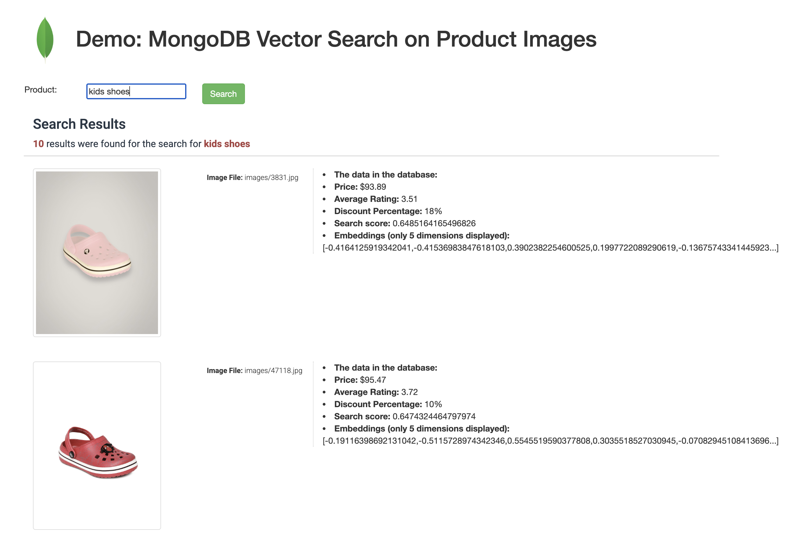
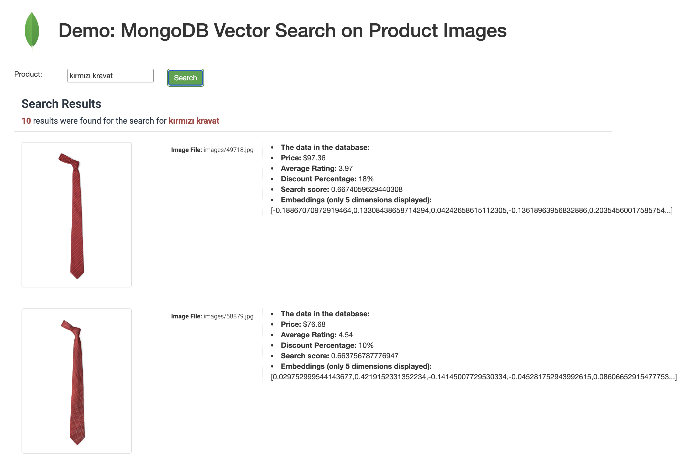
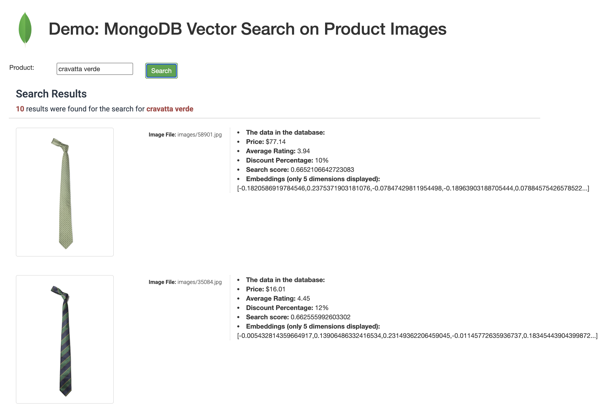
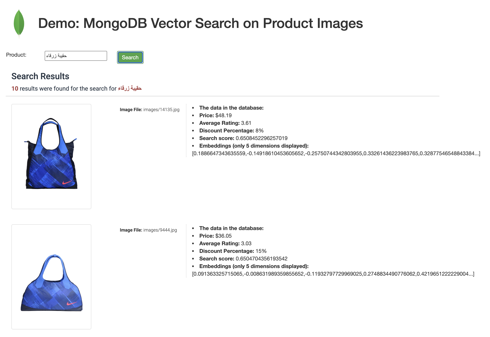
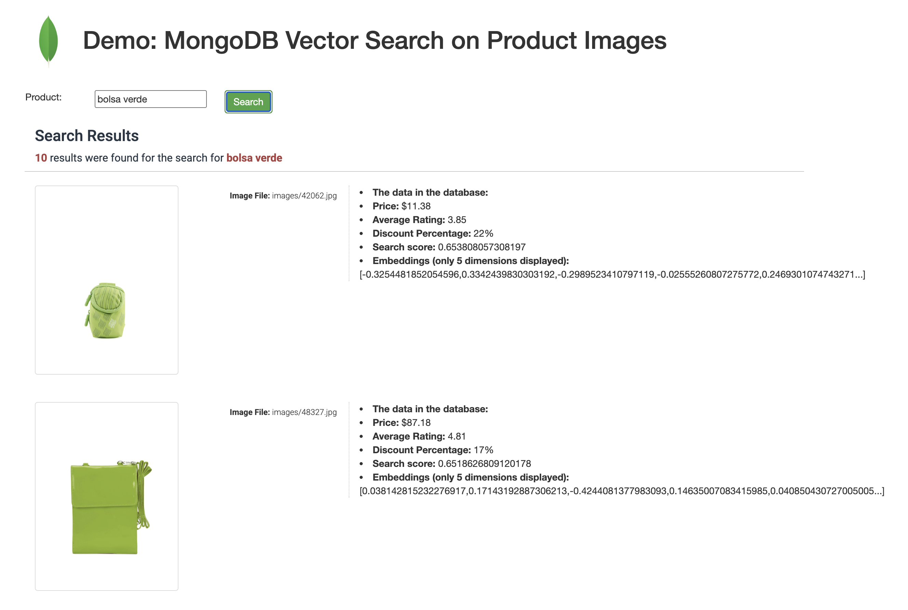
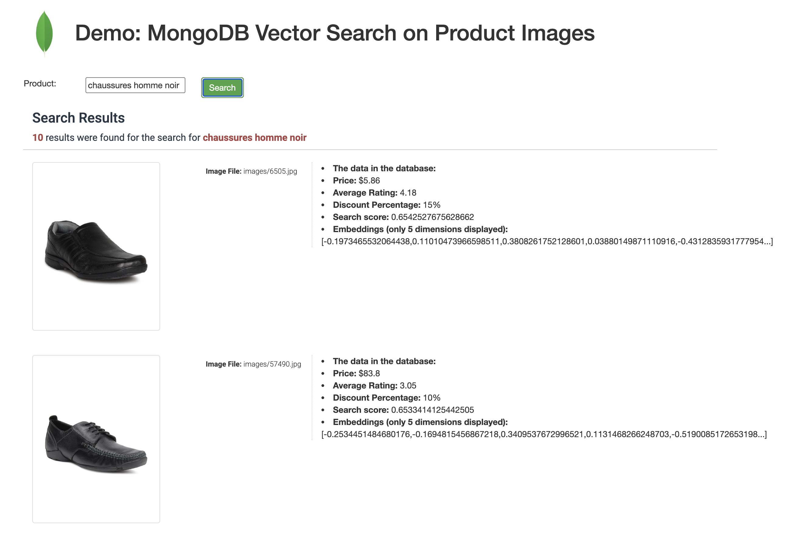

# Multi-Lingual MongoDB Vector Search (Images) on Fashion Products

How can a search be conducted for the visual attributes of products that were not included in the product's metadata?
To clarify further, imagine having millions of fashion products without any information about their color or category. You have the following basic data model:

```json
{
    "imageFile": "images/7475.jpg",
    "price": 15.66,
    "discountPercentage": 7,
    "avgRating" : 3.47
}
```

Furthermore, our users wish to perform a search such as **"green shirts"** and our objective is to retrieve the products where the corresponding image (e.g., images/7475.jpg) portrays a **green shirt**. This can be easily achieved using Vector Search.

[Multi-Lingual examples here ](#multi-lingual-search-results)([English](#english) | [Turkish](#turkish-red-tie) | [Italian](#italian-green-tie) | [Arabic](#arabic-blue-bag) | [Spanish](#spanish-green-bag)) | [French](#french-black-man-shoes)

Consider this search query: On the right side, you'll find a sample entry from a database that lacks metadata like the product's "color" or "category." Nevertheless, our search appears to be successful as it matches the visual attributes of the product.


In simpler terms, the application transforms the given texts into vectors, which are then sent to MongoDB Atlas. Using Atlas Search, the system compares these vectors with those in the collection and identifies the most similar vectors to the given one.

Another example:


## Image Repository
- Kaggle provides a product data set catalogs:
  - [Higher Resolution (25GB)](https://www.kaggle.com/datasets/paramaggarwal/fashion-product-images-dataset)
  - [Lower Resolution (600MB)](https://www.kaggle.com/datasets/paramaggarwal/fashion-product-images-small)
- If you have any other product catalog images, you can also leverage that.
- **You extract the images under this encoder folder such as `encoder/images/`**
  - You have jpg files such as `encoder/images/1.jpg`, `encode/images/abc.jpeg`

## Embedding Models
There are 2 models evaluated.
  - Default: [clip-ViT-L-14](https://huggingface.co/sentence-transformers/clip-ViT-L-14): Works very well for english language searches (768 dimensions)
  - [sentence-transformers/clip-ViT-B-32](https://huggingface.co/sentence-transformers/clip-ViT-B-32): Works well for multi-lingual searches (512 dimensions)

If you don't want to use the default one, please don't forget to change the number of dimensions too in the `config.py` file.

## Prerequisites

- **Python Version**: Python 3.9 or later  
- **Python Packages** (install with `pip install`):
  - sentence-transformers  
  - transformers  
  - Pillow  
  - pymongo  
- **MongoDB**: MongoDB (Atlas or Enterprise Advanced or Community) with Vector Search enabled  

## Configuration

- Database connection
  - Please make the necessary changes to the `config/config.py` file by updating the database connection string, as well as the details of the database and collection.
- Model
  - Choose either multilingual or only-english model and don't forget to set proper number of dimensions in the `config.py` too
    - Multi-lingual model encodes the images in 512 dimensions

## Start Vectorization

You have already extracted the images under this project structure such as `encoder/images/`.

Switch to `encoder/`
And run the `encoder_and_loader.py` by providing the folder such as `images/`

```bash
$ python encoder_and_loader.py images/
```

It will download the pre-trained model first and then will create worker threads (It will run on 4 processes by default, you can configure this in the `config.py`), and these processes will go through all the files under the `images/` folder and load the vectors inside the MongoDB collection.


The process may require a considerable amount of time, which is dependent on the hardware resources available on this utility and database server distance.

Once the process is finished, you can verify the collection using the instructions provided below.


## Run the Web Application to Search for Products

Switch to `webapp/` folder and run `flask_server.py`.

```bash
$ python flask_server.py
```

This web application has 2 pages:

For a simple product search, open a browser and navigate to `http://localhost:5010/`.
For advanced search (multiple conditions), navigate to `http://localhost:5010/advanced`.

And give it a try!
------------------


### Multi-Lingual Search Results
- [English](#english) | [Turkish](#turkish-red-tie) | [English](#italian-green-tie) | [Arabic](#arabic-blue-bag) | [Spanish](#spanish-green-bag)
#### English

#### Turkish (Red Tie)

#### Italian (Green Tie)

#### Arabic (Blue Bag)

#### Spanish (Green Bag)

#### French (Black man shoes)



### Other Screenshots  
[Other Screenshots](readme_images/README.md)